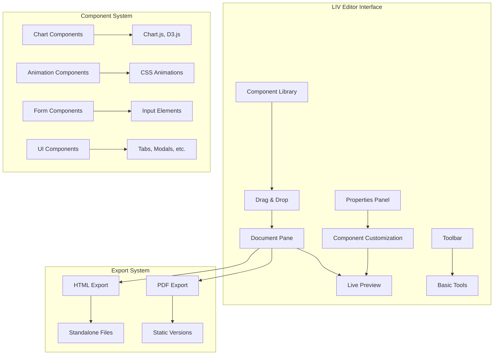
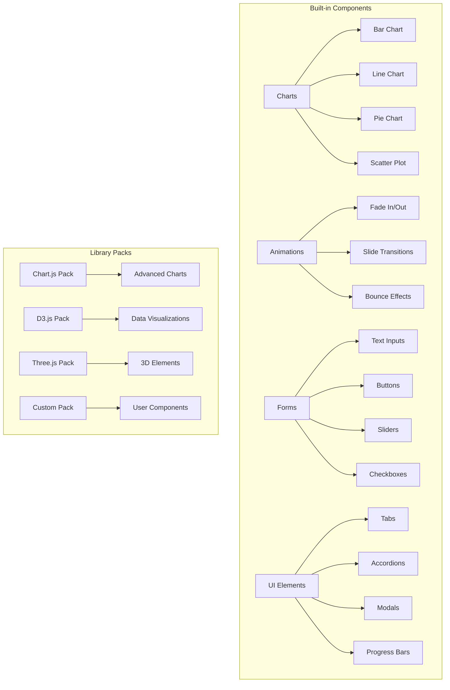

# .liv Document Editor Design

## Overview

The .liv editor is a simple, dual-pane application that works like a PDF editor but with drag-and-drop interactive components. Users can easily create rich, interactive documents by dragging pre-built elements from a component library into their document. The focus is on simplicity, usability, and providing immediate results without coding.

## Architecture

### Simple Dual-Pane Architecture



### Component Library Structure



## Components and Interfaces

### 1. Editor Interface Layout

```
┌─────────────────────────────────────────────────────────────┐
│ File  Edit  Insert  View  Tools                    Help    │
├─────────────────────────────────────────────────────────────┤
│ [Save] [Undo] [Redo] | [Text] [Image] [Component] | Export │
├─────────────────────────────────────────────────────────────┤
│                                                             │
│  Document Pane                    │  Component Library      │
│  ┌─────────────────────────────┐  │  ┌─────────────────────┐│
│  │                             │  │  │ 📊 Charts           ││
│  │   [Document Content]        │  │  │  ├ Bar Chart        ││
│  │                             │  │  │  ├ Line Chart       ││
│  │   [Dropped Components]      │  │  │  └ Pie Chart        ││
│  │                             │  │  │                     ││
│  │                             │  │  │ 🎬 Animations       ││
│  │                             │  │  │  ├ Fade In          ││
│  │                             │  │  │  └ Slide Up         ││
│  │                             │  │  │                     ││
│  │                             │  │  │ 📝 Forms            ││
│  │                             │  │  │  ├ Text Input       ││
│  │                             │  │  │  └ Button           ││
│  └─────────────────────────────┘  │  └─────────────────────┘│
│                                   │                         │
├───────────────────────────────────┼─────────────────────────┤
│ Properties Panel                  │ Library Manager         │
│ ┌─────────────────────────────────┼─────────────────────────┤
│ │ Selected: Bar Chart             │ [+ Add Library Pack]    │
│ │ ├ Data Source: [Browse...]      │ [📦 Chart.js Pack]      │
│ │ ├ Color: [Blue ▼]              │ [📦 D3.js Pack]         │
│ │ └ Animation: [Fade In ▼]       │ [📦 Custom Pack]        │
│ └─────────────────────────────────┴─────────────────────────┘
└─────────────────────────────────────────────────────────────┘
```

### 2. Component Structure

Each component is a self-contained snippet with HTML, CSS, and JS:

```javascript
// Example: Bar Chart Component
const BarChartComponent = {
  id: "bar-chart-basic",
  name: "Bar Chart",
  category: "charts",
  icon: "📊",
  description: "Simple animated bar chart",
  
  // The actual component code
  template: `
    <div class="bar-chart-container" id="{{id}}">
      <canvas class="bar-chart"></canvas>
    </div>
  `,
  
  styles: `
    .bar-chart-container {
      width: 100%;
      height: 300px;
      padding: 20px;
      background: #f9f9f9;
      border-radius: 8px;
    }
    .bar-chart {
      width: 100%;
      height: 100%;
    }
  `,
  
  script: `
    // Chart.js implementation
    const ctx = document.querySelector('#{{id}} .bar-chart').getContext('2d');
    new Chart(ctx, {
      type: 'bar',
      data: {{data}},
      options: {{options}}
    });
  `,
  
  // Customizable properties
  properties: {
    data: {
      type: "json",
      default: {
        labels: ['A', 'B', 'C'],
        datasets: [{
          data: [10, 20, 30],
          backgroundColor: '#3498db'
        }]
      }
    },
    color: {
      type: "color",
      default: "#3498db"
    },
    animation: {
      type: "select",
      options: ["none", "fade", "slide"],
      default: "fade"
    }
  }
};
```

### 3. Simple JavaScript Architecture

The editor is built with vanilla JavaScript/TypeScript for simplicity:

```typescript
// Main Editor Class
class LIVEditor {
  private documentPane: DocumentPane;
  private componentLibrary: ComponentLibrary;
  private propertiesPanel: PropertiesPanel;
  private libraryManager: LibraryManager;
  
  constructor() {
    this.initializeInterface();
    this.setupDragAndDrop();
    this.loadDefaultComponents();
  }
  
  private setupDragAndDrop() {
    // Simple HTML5 drag and drop
    this.componentLibrary.onDragStart = (component) => {
      this.draggedComponent = component;
    };
    
    this.documentPane.onDrop = (event) => {
      this.insertComponent(this.draggedComponent, event.position);
    };
  }
}

// Component Library Management
class ComponentLibrary {
  private components: Map<string, Component> = new Map();
  
  addComponent(component: Component) {
    this.components.set(component.id, component);
    this.renderComponentInLibrary(component);
  }
  
  private renderComponentInLibrary(component: Component) {
    const element = document.createElement('div');
    element.className = 'component-item';
    element.draggable = true;
    element.innerHTML = `
      <div class="component-icon">${component.icon}</div>
      <div class="component-name">${component.name}</div>
    `;
    this.libraryContainer.appendChild(element);
  }
}

// Document Management
class DocumentPane {
  private document: LIVDocument;
  
  insertComponent(component: Component, position: Position) {
    const instance = this.createComponentInstance(component);
    this.document.addComponent(instance, position);
    this.renderComponent(instance);
  }
  
  private createComponentInstance(component: Component): ComponentInstance {
    return {
      id: generateId(),
      componentId: component.id,
      properties: { ...component.properties },
      position: { x: 0, y: 0 },
      size: { width: 300, height: 200 }
    };
  }
}
```

### 4. Library Pack System

Library packs allow easy integration of popular JavaScript libraries:

```typescript
// Library Pack Definition
interface LibraryPack {
  id: string;
  name: string;
  version: string;
  description: string;
  dependencies: string[]; // CDN URLs for libraries
  components: Component[];
}

// Example: Chart.js Pack
const ChartJSPack: LibraryPack = {
  id: "chartjs-pack",
  name: "Chart.js Components",
  version: "1.0.0",
  description: "Professional charts using Chart.js library",
  dependencies: [
    "https://cdn.jsdelivr.net/npm/chart.js@4.4.0/dist/chart.umd.js"
  ],
  components: [
    {
      id: "chartjs-bar",
      name: "Bar Chart (Chart.js)",
      category: "charts",
      icon: "📊",
      template: `<div class="chartjs-container"><canvas></canvas></div>`,
      script: `
        new Chart(this.querySelector('canvas'), {
          type: 'bar',
          data: {{data}},
          options: {{options}}
        });
      `,
      properties: {
        data: { type: "json", default: defaultBarData },
        responsive: { type: "boolean", default: true },
        animation: { type: "boolean", default: true }
      }
    }
  ]
};

// Library Manager
class LibraryManager {
  private installedPacks: Map<string, LibraryPack> = new Map();
  
  async installPack(packUrl: string) {
    const pack = await this.loadPackFromUrl(packUrl);
    await this.loadDependencies(pack.dependencies);
    this.installedPacks.set(pack.id, pack);
    this.componentLibrary.addComponents(pack.components);
  }
  
  getAvailablePacks(): LibraryPack[] {
    return [
      ChartJSPack,
      D3JSPack,
      ThreeJSPack,
      // ... more built-in packs
    ];
  }
}
```

## Data Models

### Simple Document Structure

```typescript
// Main Document Model
interface LIVDocument {
  metadata: DocumentMetadata;
  components: ComponentInstance[];
  styles: DocumentStyles;
  libraries: string[]; // List of loaded library pack IDs
}

interface DocumentMetadata {
  title: string;
  author: string;
  created: Date;
  modified: Date;
  template?: string;
  theme?: string;
}

interface ComponentInstance {
  id: string;
  componentId: string; // Reference to component definition
  position: Position;
  size: Size;
  properties: Record<string, any>;
  customCSS?: string;
}

interface Position {
  x: number;
  y: number;
  z?: number; // For layering
}

interface Size {
  width: number;
  height: number;
}

// Component Definition Model
interface Component {
  id: string;
  name: string;
  category: ComponentCategory;
  icon: string;
  description: string;
  template: string; // HTML template with {{placeholders}}
  styles: string;   // CSS styles
  script: string;   // JavaScript code
  properties: ComponentProperties;
  preview?: string; // Base64 preview image
}

type ComponentCategory = 'charts' | 'animations' | 'forms' | 'ui' | 'media' | 'custom';

interface ComponentProperties {
  [key: string]: PropertyDefinition;
}

interface PropertyDefinition {
  type: 'string' | 'number' | 'boolean' | 'color' | 'select' | 'json' | 'file';
  default: any;
  options?: any[]; // For select type
  validation?: ValidationRule[];
}
```

### File Format

The .liv file is a simple JSON document with embedded assets:

```typescript
// File Structure
interface LIVFile {
  version: string;
  document: LIVDocument;
  assets: AssetBundle;
  libraries: LibraryBundle;
}

interface AssetBundle {
  images: Record<string, string>; // Base64 encoded images
  fonts: Record<string, string>;  // Base64 encoded fonts
  data: Record<string, any>;      // JSON data for charts/components
}

interface LibraryBundle {
  packs: Record<string, LibraryPack>;
  dependencies: Record<string, string>; // Cached library files
}

// Example .liv file content
{
  "version": "1.0",
  "document": {
    "metadata": {
      "title": "My Interactive Report",
      "author": "John Doe",
      "created": "2024-01-01T00:00:00Z",
      "template": "business-report"
    },
    "components": [
      {
        "id": "chart-1",
        "componentId": "chartjs-bar",
        "position": { "x": 100, "y": 200 },
        "size": { "width": 400, "height": 300 },
        "properties": {
          "data": {
            "labels": ["Q1", "Q2", "Q3", "Q4"],
            "datasets": [{
              "data": [10, 20, 15, 25],
              "backgroundColor": "#3498db"
            }]
          },
          "title": "Quarterly Sales"
        }
      }
    ],
    "libraries": ["chartjs-pack"]
  },
  "assets": {
    "images": {
      "logo.png": "data:image/png;base64,..."
    }
  }
}
```

## User Experience Flow

### Creating a New Document

1. **Template Selection**
   ```
   User opens LIV Editor
   → Choose template (Report, Presentation, Dashboard, Blank)
   → Select theme (Minimal, Corporate, Creative)
   → Document opens with template layout
   ```

2. **Adding Components**
   ```
   User browses component library
   → Drag component (e.g., Bar Chart) to document
   → Component appears with default data
   → Properties panel shows customization options
   ```

3. **Customizing Components**
   ```
   User selects component
   → Properties panel shows relevant controls
   → Change colors, upload data, adjust animations
   → Live preview updates immediately
   ```

4. **Managing Libraries**
   ```
   User clicks "Add Library Pack"
   → Browse available packs (Chart.js, D3.js, etc.)
   → One-click install adds new components to library
   → Components immediately available for use
   ```

### Export Workflow

```typescript
class ExportManager {
  exportToHTML(document: LIVDocument): string {
    // Generate standalone HTML file
    // Embed all CSS, JS, and assets
    // Optimize for web deployment
  }
  
  exportToPDF(document: LIVDocument): Blob {
    // Convert interactive components to static images
    // Maintain layout and styling
    // Generate print-ready PDF
  }
  
  exportToTemplate(document: LIVDocument): TemplateFile {
    // Save document as reusable template
    // Strip specific content, keep structure
    // Allow sharing with other users
  }
}
```

## Built-in Component Library

### Chart Components
- **Bar Chart**: Animated bar charts with customizable colors and data
- **Line Chart**: Smooth line graphs with multiple datasets
- **Pie Chart**: Interactive pie charts with hover effects
- **Scatter Plot**: Data point visualization with trend lines
- **Area Chart**: Filled area charts for trend visualization

### Animation Components
- **Fade Effects**: Fade in/out animations with timing controls
- **Slide Transitions**: Slide up/down/left/right animations
- **Bounce Effects**: Playful bounce animations for emphasis
- **Rotate Animations**: Rotation effects for icons and elements
- **Scale Effects**: Zoom in/out animations

### Form Components
- **Text Input**: Styled text input fields with validation
- **Button**: Customizable buttons with hover effects
- **Slider**: Range sliders for numeric input
- **Checkbox**: Styled checkboxes with custom designs
- **Radio Buttons**: Radio button groups with themes

### UI Components
- **Tabs**: Tabbed content areas with smooth transitions
- **Accordion**: Collapsible content sections
- **Modal**: Popup dialogs and overlays
- **Progress Bar**: Animated progress indicators
- **Card**: Content cards with shadows and borders
- **Timeline**: Vertical timeline for events/milestones

### Media Components
- **Image Gallery**: Responsive image galleries with lightbox
- **Video Player**: Custom video player with controls
- **Audio Player**: Styled audio player with waveform
- **Icon Set**: Collection of scalable vector icons

## Implementation Plan

### Phase 1: Core Editor (Week 1-2)
- Basic dual-pane interface layout
- Simple drag-and-drop functionality
- Basic component rendering system
- File save/load functionality

### Phase 2: Component Library (Week 3-4)
- Built-in component collection (charts, forms, UI)
- Properties panel for component customization
- Template system with basic themes
- Export to HTML functionality

### Phase 3: Library Packs (Week 5-6)
- Library pack system architecture
- Chart.js integration pack
- D3.js integration pack
- Custom component creation tools

### Phase 4: Polish & Export (Week 7-8)
- PDF export functionality
- Performance optimizations
- User experience improvements
- Documentation and tutorials

### Technology Stack
- **Frontend**: Vanilla TypeScript/JavaScript (no heavy frameworks)
- **UI**: Simple CSS with CSS Grid/Flexbox
- **Charts**: Chart.js, D3.js (via library packs)
- **File Format**: JSON with Base64 embedded assets
- **Export**: HTML generation, PDF via Puppeteer/similar
- **Desktop**: Electron wrapper for cross-platform support

### Key Design Principles
1. **Simplicity First**: No complex configuration or setup
2. **Immediate Results**: Drag, drop, see results instantly
3. **No Coding Required**: Everything through visual interface
4. **Extensible**: Easy to add new component libraries
5. **Clean UI**: Minimal, distraction-free interface
6. **Fast Performance**: Lightweight and responsive